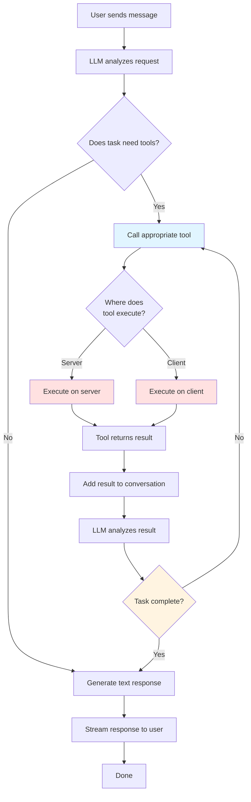
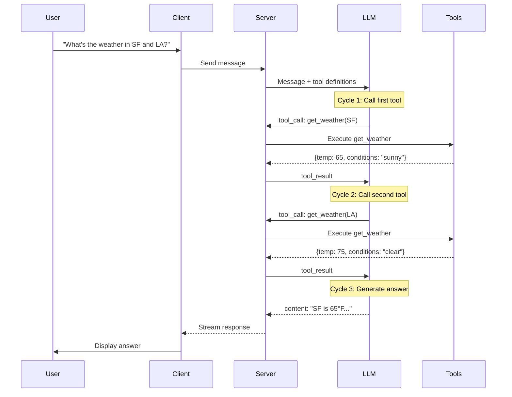

The agentic cycle is the pattern where the LLM repeatedly calls tools, receives results, and continues reasoning until it can provide a final answer. This enables complex multi-step operations.



### Detailed Agentic Flow



### Multi-Step Example

Here's a real-world example of the agentic cycle:

**User**: "Find me flights to Paris under $500 and book the cheapest one"

**Cycle 1**: LLM calls `searchFlights({destination: "Paris", maxPrice: 500})`
- Tool returns: `[{id: "F1", price: 450}, {id: "F2", price: 480}]`

**Cycle 2**: LLM analyzes results and calls `bookFlight({flightId: "F1"})`
- Tool requires approval (sensitive operation)
- User approves
- Tool returns: `{bookingId: "B123", confirmed: true}`

**Cycle 3**: LLM generates final response
- "I found 2 flights under $500. I've booked the cheapest one (Flight F1) for $450. Your booking ID is B123."

### Code Example: Agentic Weather Assistant

```typescript
// Tool definitions
const getWeatherDef = toolDefinition({
  name: "get_weather",
  description: "Get current weather for a city",
  inputSchema: z.object({
    city: z.string(),
  }),
});

const getClothingAdviceDef = toolDefinition({
  name: "get_clothing_advice",
  description: "Get clothing recommendations based on weather",
  inputSchema: z.object({
    temperature: z.number(),
    conditions: z.string(),
  }),
});

// Server implementations
const getWeather = getWeatherDef.server(async ({ city }) => {
  const response = await fetch(`https://api.weather.com/v1/${city}`);
  return await response.json();
});

const getClothingAdvice = getClothingAdviceDef.server(async ({ temperature, conditions }) => {
  // Business logic for clothing recommendations
  if (temperature < 50) {
    return { recommendation: "Wear a warm jacket" };
  }
  return { recommendation: "Light clothing is fine" };
});

// Server route
export async function POST(request: Request) {
  const { messages } = await request.json();

  const stream = chat({
    adapter: openai(),
    messages,
    model: "gpt-4o",
    tools: [getWeather, getClothingAdvice],
  });

  return toStreamResponse(stream);
}
```

**User**: "What should I wear in San Francisco today?"

**Agentic Cycle**:
1. LLM calls `get_weather({city: "San Francisco"})` → Returns `{temp: 62, conditions: "cloudy"}`
2. LLM calls `get_clothing_advice({temperature: 62, conditions: "cloudy"})` → Returns `{recommendation: "Light jacket recommended"}`
3. LLM generates: "The weather in San Francisco is 62°F and cloudy. I recommend wearing a light jacket."